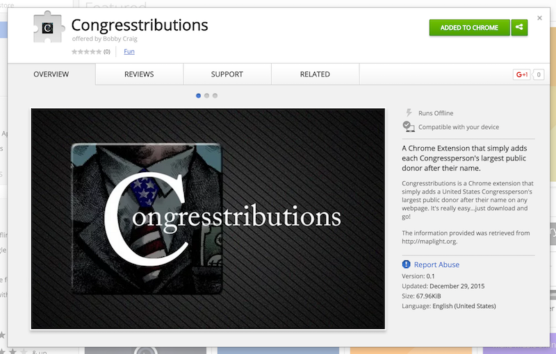

# Congresstributions

### UPDATE: This project will not be updated due to OpenSecret's small number of API calls allowed. The extension wouldn't be able to last very long with only 200 calls a month. Won't be working on this anymore...but I'll leave this repo on GitHub.

Congresstributions allows anyone to see who their public servants are *really* serving. Simply download the extension, enable it, and you'll see your Congressperson's highest public contributor added after their name. All contribution info is from [this](http://maplight.org/) wonderful site, so much thanks to MapLight!  

The extension can be quickly downloaded at [this](https://chrome.google.com/webstore/detail/congresstributions/pilhmclmlbcgdanljcmiolfcbeogejpd) link or you can type  "Congresstributions" in the Chrome store for yourself! As always, I'd love feedback!..I'm excited for the next version.

I found out that OpenSecrets.org has an API, so I want to fix this from being hardcoded to completely adjustable via the API. I'll get around to this eventually...

 

Imma work on this next.
